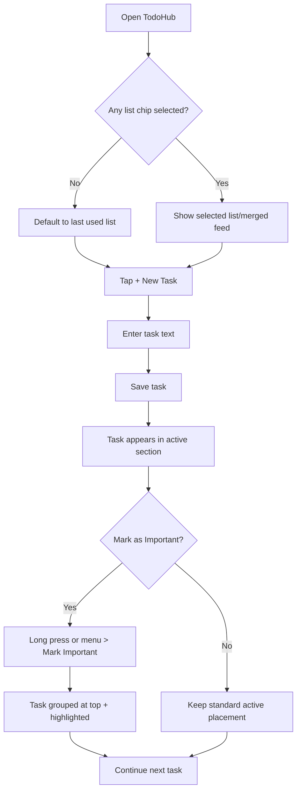
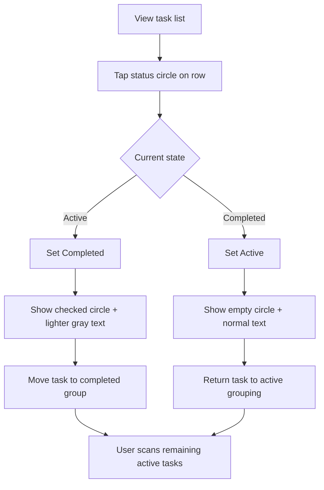
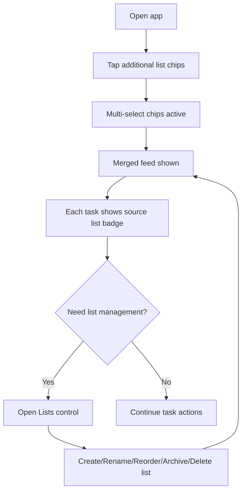
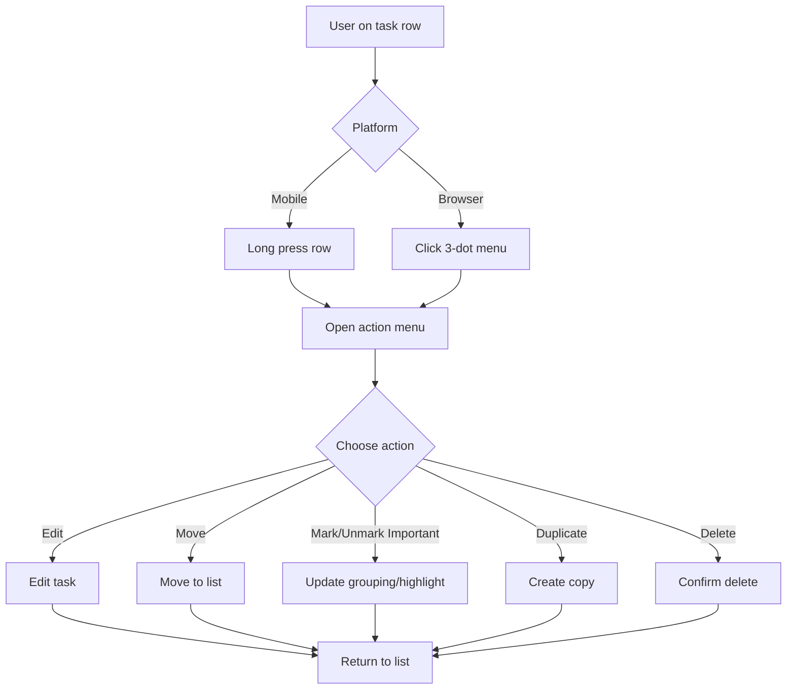

---
stepsCompleted:
  - step-01-init
  - step-02-discovery
  - step-03-core-experience
  - step-04-emotional-response
  - step-05-inspiration
  - step-06-design-system
  - step-07-defining-experience
  - step-08-visual-foundation
  - step-09-design-directions
  - step-10-user-journeys
  - step-11-component-strategy
  - step-12-ux-patterns
  - step-13-responsive-accessibility
  - step-14-complete
inputDocuments:
  - /Users/antonioattanasio/Desktop/aine/bmad/todo/_bmad-output/planning-artifacts/prd.md
  - /Users/antonioattanasio/Desktop/aine/bmad/todo/_bmad-output/planning-artifacts/prd_executive_draft.md
  - /Users/antonioattanasio/Desktop/aine/bmad/todo/_bmad-output/planning-artifacts/prd_scoping_draft.md
  - /Users/antonioattanasio/Desktop/aine/bmad/todo/_bmad-output/project-context.md
  - /Users/antonioattanasio/Desktop/aine/bmad/todo/_bmad-output/planning-artifacts/architecture.md
workflowType: 'ux-design'
lastStep: 14
status: 'complete'
completedAt: '2026-03-18'
---

# UX Design Specification TodoHub

**Author:** Antonio
**Date:** 2026-03-17

---

<!-- UX design content will be appended sequentially through collaborative workflow steps -->

## Executive Summary

### Project Vision

todo is a lightweight, mobile-first productivity app designed to reduce friction in personal task management. The UX vision is immediate control: users should capture, prioritize, and complete tasks with minimal cognitive load while trusting that data persists reliably across refreshes and restarts.

### Target Users

Primary users are individuals who need fast task capture and clear progress visibility across multiple lists. They often operate in time-constrained contexts and expect simple interactions on both mobile and desktop. Secondary users include structured planners who reprioritize frequently and need predictable behavior when task status changes.

### Key Design Challenges

- Balancing speed and clarity: supporting rapid interactions without losing list-level structure.
- Designing deterministic task ordering and important visibility that remains intuitive during frequent state changes.
- Preserving trust through resilient local-first behavior and clear feedback for persistence, loading, and error states.

### Design Opportunities

- Create a highly responsive interaction model that feels instantaneous for add, toggle, and important actions.
- Differentiate through visual focus mechanics: important pinning, completion partitioning, and clean list hierarchy.
- Build confidence with transparent state feedback and accessible keyboard-first interaction patterns.

## Core User Experience

### Defining Experience

The core experience is rapid task flow with minimal friction: capture a task instantly, organize it in the right list, and progress it to completion without losing context. The primary value loop is add -> prioritize -> complete -> review, repeated quickly throughout the day.

### Platform Strategy

Primary platform is web with mobile-first interaction priorities and full desktop support. Touch interactions must feel immediate on mobile, while keyboard actions (especially spacebar toggle and quick entry patterns) must remain first-class for desktop productivity. Offline-capable local-first behavior is a requirement, with graceful sync to backend.

### Effortless Interactions

- Fast task creation with immediate visual confirmation.
- One-tap/one-key completion toggling with predictable item movement.
- Important marking that is obvious, constrained, and reversible.
- Seamless list switching and context retention.
- Automatic persistence and recovery without user intervention.

### Critical Success Moments

- First-session win: user creates a list and adds first task in seconds.
- Control moment: user marks important tasks and instantly sees focus improve.
- Trust moment: user refreshes/reopens and all data is exactly where expected.
- Completion moment: user checks off tasks and clearly perceives progress.

### Experience Principles

- Speed is clarity: every core action should complete with minimal steps and immediate feedback.
- Focus over clutter: emphasize what matters now (important + incomplete) while preserving history.
- Predictability builds trust: ordering, state transitions, and persistence behavior must be consistent.
- Accessibility is default: keyboard, touch, and readable states are first-class, not fallback.

## Desired Emotional Response

### Primary Emotional Goals

Users should feel calm, in control, and capable when managing tasks. The primary emotional outcome is "I know exactly what to do next, and I can do it fast." The product should reduce anxiety caused by messy task lists and replace it with focused momentum.

### Emotional Journey Mapping

- First discovery: relief and clarity ("this is simple, not overwhelming").
- During core usage: speed-confidence ("I can capture and organize instantly").
- After task actions: accomplishment and progress ("I moved things forward").
- During errors/recovery: trust ("the app explains clearly and protects my work").
- On return sessions: continuity and confidence ("everything is where I left it").

### Micro-Emotions

- Confidence over confusion in every interaction.
- Trust over skepticism during save/sync states.
- Accomplishment over friction when completing tasks.
- Calm focus over cognitive overload in list views.
- Light delight in smooth transitions and clear feedback.

### Design Implications

- Calm/control: clear hierarchy, predictable sorting, minimal visual noise.
- Confidence/trust: immediate feedback for add/toggle/important and explicit persistence states.
- Accomplishment: strong completion affordances with satisfying but subtle state transitions.
- Anxiety reduction: preserve completed context without clutter; keep important items visibly anchored.
- Delight without distraction: micro-interactions should reinforce progress, not steal attention.

### Emotional Design Principles

- Clarity creates calm: users should never wonder what state they are in.
- Predictability creates trust: state transitions and ordering are consistent.
- Speed creates confidence: core actions feel instant.
- Visible progress creates motivation: completion and prioritization are emotionally rewarding.
- Recovery preserves trust: failures are understandable, recoverable, and non-destructive.

## UX Pattern Analysis & Inspiration

### Inspiring Products Analysis

**Google Tasks**
- Strong list segmentation through tab-based layout for fast context switching.
- Clear task ordering model that supports quick prioritization and scanning.
- Responsive behavior that keeps interactions lightweight and fast.
- Minimal visual noise, keeping focus on the task action itself.

**Second app (name unknown)**
- Extremely clean and simple interface with low cognitive overhead.
- Efficient task ordering behavior that made daily use feel fluid.
- Strong sense of visual calm and immediate comprehension.

### Transferable UX Patterns

- Tab/list-based context switching for independent task groups.
- Deterministic ordering model with clear top-of-list focus behavior.
- Mobile-first responsive layout with fast transitions and minimal latency perception.
- Visual simplicity: reduce non-essential UI chrome and keep primary actions always visible.
- Quick-action interactions (add, reorder, complete) with immediate feedback.

### Anti-Patterns to Avoid

- Overloaded screens with too many controls visible at once.
- Ambiguous ordering rules that make task position feel unpredictable.
- Heavy animations or transitions that reduce perceived speed.
- Buried core actions (add, complete, prioritize) behind extra navigation layers.
- Inconsistent list switching patterns across mobile and desktop.

### Design Inspiration Strategy

**What to Adopt**
- Tab-oriented list navigation inspired by Google Tasks for fast list switching.
- Efficient, predictable ordering behavior as a core trust mechanism.
- Clean visual hierarchy emphasizing tasks and progress over decorative elements.

**What to Adapt**
- Tab layout adapted to support important + incomplete-first workflow from the PRD.
- Ordering model adapted to include explicit completion partition behavior.
- Simplicity adapted with stronger accessibility cues for keyboard and touch users.

**What to Avoid**
- Feature clutter that conflicts with calm/control emotional goals.
- Hidden or indirect interactions that slow the primary task loop.
- Any ordering behavior that changes without clear user intent.

## Design System Foundation

### 1.1 Design System Choice

Themeable system selected: **Tailwind CSS + headless component primitives** (Radix/shadcn-style approach) for the web frontend.

### Rationale for Selection

- Best balance of speed, customization, and long-term maintainability.
- Supports a clean, minimal UX with strong control over spacing, hierarchy, and interaction states.
- Strong performance profile for a mobile-first responsive app.
- Avoids rigid visual constraints of fully opinionated component suites.
- Aligns with architecture goals: reactive UI, future extensibility, and clear design consistency rules.

### Implementation Approach

- Use Tailwind as the tokenized styling layer (spacing, type scale, color roles, radii, shadows, motion timing).
- Build reusable UI primitives on top of headless components for accessibility and behavior consistency.
- Define a small foundational component set first:
  - Button, Input, Checkbox, Tabs/List switcher, Badge/Important chip, Card/List item, Modal/Confirm dialog, Toast.
- Enforce variant-driven components (size/state/intent) to avoid ad-hoc styling drift.

### Customization Strategy

- Establish design tokens in Tailwind config:
  - semantic colors (surface, text, accent, success, warning, danger)
  - spacing and radius scales
  - typography scale and weights
  - motion durations/easing for subtle feedback only
- Start with a neutral visual baseline optimized for readability and focus.
- Add brand-specific visual identity through token overrides, not one-off component styling.
- Keep interactions intentionally lightweight: micro-feedback for add/complete/prioritize, no heavy animations.

## 2. Core User Experience

### 2.1 Defining Experience

The defining experience of todo is "capture and regain control in seconds." Users should be able to enter tasks quickly, place them in the right list context, and see immediate ordering that highlights what matters now. The product feels special when the user can move from mental overload to focused next actions almost instantly.

### 2.2 User Mental Model

Users approach todo management with a simple mental model:
- "I need to write this down now so I don't forget."
- "I need to see what's most important first."
- "I need to mark progress without losing context."

They expect:
- Fast entry with minimal navigation.
- Stable, predictable ordering behavior.
- Clear separation between active and completed tasks.
- Persistent state that survives refreshes and returns exactly as left.

Likely confusion points to avoid:
- Hidden ordering logic.
- Important status not visibly reflected in list position and styling.
- Ambiguous save/sync status.

### 2.3 Success Criteria

Core interaction is successful when:
- A new task can be captured and confirmed in one short flow.
- Important toggles are instantly visible and understandable.
- Completion toggles feel immediate and move tasks predictably.
- Users can switch list contexts without cognitive reset.
- Persistence trust is reinforced through consistent reload state.

Success indicators:
- Users complete first add-and-mark-important flow without guidance.
- Users can explain ordering behavior after brief usage.
- Return sessions require no re-orientation.

### 2.4 Novel UX Patterns

This product primarily leverages established patterns (lists, tabs, check interactions, importance badges) because speed and clarity are core goals. Innovation should happen through composition, not novelty:
- Combine familiar task-list behaviors with deterministic "important + incomplete first" ordering.
- Use subtle interaction feedback to create confidence and delight.
- Preserve completed-task context while maintaining active-task visual dominance.

### 2.5 Experience Mechanics

1. Initiation
- User opens app into last-used or default list context.
- Primary input affordance is always visible and ready for quick entry.

2. Interaction
- User adds task text and commits quickly.
- User can mark/unmark important with immediate positional and visual feedback.
- User toggles completion through one tap/click or keyboard shortcut.

3. Feedback
- Instant visual confirmation on add, important change, and completion state.
- Important items are grouped at the top and highlighted.
- Clear ordering shifts communicate system logic without extra explanation.
- Error/persistence states are explicit and non-technical.

4. Completion
- User sees updated, correctly ordered list with progress reflected.
- Completed items remain accessible in a reduced-salience area.
- User naturally continues with next important or next incomplete task.

## Visual Design Foundation

### Color System

Theme direction: grayscale paper-pen aesthetic with a single teal accent.

Grayscale base:
- Paper background: #F7F5F2
- Card/sheet: #FFFFFF
- Ink primary: #1E1E1E
- Ink secondary: #4B4B4B
- Ink muted: #757575
- Divider/light rule: #D8D3CC
- Border/line: #BFB8AE

Primary accent (actions + important state):
- Teal primary: #0F766E
- Teal hover: #115E59
- Important tint background: #E6F4F2

State handling:
- Important tasks:
  - icon/text/accent border: #0F766E
  - subtle row/chip tint: #E6F4F2
- Completed tasks:
  - lighter gray text: #A29C92
  - optional muted icon/meta: #B8B1A6
  - no saturated state color for completion

### Typography System

Tone target: calm, practical, legible.

Primary typeface:
- Inter (fallback: ui-sans-serif, system-ui, sans-serif)

Type scale:
- H1: 30/36, 700
- H2: 24/32, 700
- H3: 20/28, 600
- Body: 16/24, 400
- Body-sm: 14/20, 400
- Caption: 12/16, 500

### Spacing & Layout Foundation

Base spacing unit: 8px.
- Scale: 4, 8, 12, 16, 24, 32, 40, 48
- Mobile-first list flow, desktop split-context where needed
- Subtle notebook-style separators between rows
- Radius: 10px base, 14px elevated surfaces

### Accessibility Considerations

- WCAG AA contrast for all text and controls.
- 44x44 minimum touch targets.
- Important/completed states never color-only (icon + label + style changes).
- Clear keyboard focus ring distinct from neutral borders.
- Motion is subtle and non-essential for meaning.

## Design Direction Decision

### Design Directions Explored

Design direction exploration was generated in an interactive showcase at:
- /Users/antonioattanasio/Desktop/aine/bmad/todo/_bmad-output/planning-artifacts/ux-design-directions.html

Explored direction families:
1. Notebook Minimal
2. Command Center
3. Calm Focus
4. Hybrid Practical
5. Mobile Thumb Flow
6. Structured Ledger

### Chosen Direction

Chosen direction: **Direction 5 - Mobile Thumb Flow (Refined)**

Final interaction model:
- Multi-select list chips are used for filtering and merged-list view.
- Two or more selected chips visually merge lists into one feed.
- Each task shows source list label in merged mode for context.
- Top-level `Lists` control is used for list management actions (create, rename, reorder, archive, delete).
- Row circle is status-only:
  - empty circle = Active
  - checked circle = Completed
- Row circle toggles only between Active and Completed.
- Important is not a star action; it is managed via task action menu.
- Mobile: swipe gestures support hide/remove actions.
- Mobile: long press on row opens task action menu.
- Browser: keep overflow (3-dot) menu without requiring row selection.

### Design Rationale

- Preserves calm, simple visual language while supporting advanced list workflows.
- Multi-chip merged mode improves productivity without introducing heavy navigation.
- Status-only circles remove ambiguity and improve immediate scannability.
- Separating list management from list filtering prevents accidental structural actions.
- Long-press on mobile reduces visual clutter while preserving action access.

### Implementation Approach

- Implement chip selection state with multi-select support and deterministic merge sorting.
- Preserve important grouping at top and highlight treatment in merged and single-list views.
- Add source-list badge for merged tasks only.
- Implement platform-adaptive action patterns:
  - mobile swipe for hide/remove
  - mobile long-press context menu
  - desktop 3-dot overflow menu
- Ensure accessibility parity for context actions via keyboard and assistive labels.

## User Journey Flows

### Journey 1: Quick Capture and Organize

Goal: User captures a task quickly, places it in context, and keeps momentum.

### Journey 2: Complete and Review Progress

Goal: User quickly marks work done while preserving context.

### Journey 3: Multi-List Merged Workflow

Goal: User combines multiple lists into one actionable feed.

### Journey 4: Task Action Menu (Mobile + Browser)

Goal: User performs secondary task actions without cluttering rows.

### Journey Patterns

- Primary action always visible; secondary actions contextual.
- Status toggle is direct and binary (active/completed).
- Important is menu-driven, not overloaded in row controls.
- Merged views preserve list provenance using source badges.
- Management actions are separated from day-to-day filtering.

### Flow Optimization Principles

- Minimize taps for core capture/complete loop.
- Keep sorting and state transitions deterministic.
- Preserve calm visual hierarchy while enabling power workflows.
- Use platform-native interaction patterns (long press mobile, overflow browser).
- Prioritize recoverable actions and clear feedback states.

## Component Strategy

### Design System Components

From Tailwind + headless primitives, foundation components will cover:
- Button
- Input/Text field
- Checkbox/radio primitives (adapted for status circle behavior)
- Dialog/Modal
- Sheet/Popover
- Menu primitives
- Badge/Label
- Toast/Alert
- Tooltip
- Tabs/chip-style filter controls (customized behavior)

### Custom Components

### TaskRow

**Purpose:** Primary interaction surface for task status and quick comprehension.  
**Usage:** Rendered in active and completed sections, in single-list and merged-list views.  
**Anatomy:** Status circle, task text, source-list badge (merged only), optional important highlight shell.  
**States:** active, completed, important-active, important-completed, pressed, disabled.  
**Accessibility:** status circle is keyboard/touch operable; row supports long-press on mobile for actions.  
**Interaction Behavior:** tapping circle toggles active/completed only; row long-press (mobile) opens action menu.

### MultiSelectListChips

**Purpose:** Fast list filtering and merged-list creation.  
**Usage:** Top-of-screen list selector.  
**Anatomy:** selectable chips, All/Clear utility controls, selected-state styling.  
**States:** unselected, selected, focused, overflow-wrapped.  
**Accessibility:** multi-select semantics, clear selected indication, keyboard toggling on desktop.

### ListsManagementControl

**Purpose:** Entry point for list administration (not filtering).  
**Usage:** Top bar Lists control.  
**Anatomy:** trigger button + sheet/menu with list actions.  
**Actions:** create, rename, reorder, archive, delete list.  
**Accessibility:** labeled trigger, focus-trapped sheet/dialog, confirm destructive actions.

### TaskActionMenu

**Purpose:** Secondary task actions without row clutter.  
**Usage:**  
- Mobile: opened via long-press on TaskRow  
- Browser: opened via 3-dot button  
**Actions:** Edit, Move, Mark/Unmark Important, Duplicate, Delete.  
**States:** closed, open, focused item, destructive item emphasis.  
**Accessibility:** menu roles, keyboard navigation, announced action names.

### MergedSourceBadge

**Purpose:** Preserve task provenance when multiple chips are selected.  
**Usage:** shown only in merged-list mode.  
**States:** default, overflow-truncated label if needed.  
**Accessibility:** includes accessible list-name label for screen readers.

### PriorityGroupContainer

**Purpose:** Visually and structurally group important active tasks at top.  
**Usage:** above regular active tasks in every list view.  
**States:** empty (hidden), populated, collapsed (optional future).  
**Accessibility:** region label (e.g., Important tasks).

### Component Implementation Strategy

- Build all custom components on top of headless primitives and Tailwind tokens.
- Keep interaction semantics strict:
  - status circle = active/completed toggle only
  - important toggle = action menu only
- Separate concerns:
  - filtering/merge via chips
  - list administration via Lists control
- Ensure mobile/browser parity with platform-specific action triggers.
- Encode state visuals using tokens from visual foundation (grayscale + teal accent).

### Implementation Roadmap

Phase 1 - Critical path components:
1. TaskRow
2. MultiSelectListChips
3. TaskActionMenu
4. PriorityGroupContainer

Phase 2 - Structural support:
1. ListsManagementControl
2. MergedSourceBadge
3. Confirm dialogs for destructive list/task actions

Phase 3 - Enhancement and polish:
1. Micro-feedback states (subtle transitions/haptics)
2. Empty/zero-state variants per list mode
3. Advanced chip overflow handling and adaptive density

## UX Consistency Patterns

### Button Hierarchy

Primary actions:
- Filled teal button for core progression actions (e.g., + New Task, Save).
- One primary action per view section whenever possible.

Secondary actions:
- Neutral outlined buttons for supportive actions (e.g., Clear, All, Filters).
- Tertiary text actions for lower-emphasis operations.

Destructive actions:
- Reserved destructive style in menus/dialog confirmations only.
- Never colocate destructive action as default in first position.

### Feedback Patterns

Success feedback:
- Subtle inline confirmation for task add/update/toggle.
- Lightweight toast only for non-obvious system changes.

Error feedback:
- Inline message near failing context (form/menu/action origin).
- Plain-language recovery guidance and retry option.

Important-state feedback:
- Important tasks move to top group and receive teal emphasis.
- Transition remains subtle to preserve calm visual tone.

Completion feedback:
- Status circle changes to checked mark.
- Text shifts to lighter gray and optional strike-through.
- Completed item moves to completed section predictably.

### Form Patterns

Task entry pattern:
- Single prominent input with immediate add affordance.
- Enter key submits on desktop; tap action on mobile.

Validation pattern:
- Immediate lightweight validation for required text.
- Prevent silent failures; show explicit actionable error.

Edit pattern:
- Inline quick edit where possible.
- Modal/sheet edit for expanded fields or move operations.

### Navigation Patterns

List navigation:
- Chips are primary list selectors.
- Multi-select chips allowed to create merged-list view.

Merged-list clarity:
- Each merged task row displays source-list badge.
- All/Clear controls always available in chip area.

List management:
- Dedicated Lists control (separate from chip filtering).
- Lists control opens management menu/sheet:
  - Create, Rename, Reorder, Archive, Delete.

Task actions:
- Mobile: long-press row opens action menu.
- Browser: 3-dot menu opens action menu.
- Keep status toggle separate from action menu.

### Additional Patterns

Empty states:
- Action-oriented empty messages with direct next step.
- Distinguish between no tasks vs no filter results.

Loading states:
- Skeleton list rows for initial/refresh loading.
- Avoid blocking spinners for routine list updates.

Modal and confirmation:
- Confirm only for destructive actions (delete/archive).
- Keep copy concise and consequence-focused.

Search/filter behavior:
- Filters are persistent and visible.
- Clearing filters restores deterministic default ordering.

Accessibility baseline:
- 44x44 target minimum on touch controls.
- States not color-only (shape, icon, text context).
- Keyboard and screen-reader parity for all action paths.

## Responsive Design & Accessibility

### Responsive Strategy

Mobile-first strategy with progressive enhancement for tablet and desktop.

Mobile (primary):
- Single-column task flow with thumb-friendly spacing.
- Multi-select chips for list filtering/merge.
- Long-press row for task action menu.
- Persistent + New Task primary action.

Tablet:
- Retain mobile interaction model with increased density and wider content area.
- Optional side panel for list context if landscape orientation permits.
- Preserve touch-first controls and large targets.

Desktop:
- Support higher information density without changing core mental model.
- Keep chips and merged-feed logic consistent.
- Use 3-dot menu for task actions (no long-press dependency).
- Optional split layout (lists/context + task feed) at larger widths.

### Breakpoint Strategy

Breakpoint model:
- Mobile: 320px-767px
- Tablet: 768px-1023px
- Desktop: 1024px+

Implementation approach:
- Mobile-first CSS with min-width media queries.
- Keep behavior parity; only presentation and density adapt by breakpoint.
- Avoid introducing desktop-only flow logic that diverges from core interaction semantics.

### Accessibility Strategy

Target compliance: WCAG 2.2 AA.

Core accessibility requirements:
- Text contrast and UI component contrast at AA thresholds.
- Minimum touch targets of 44x44.
- Keyboard navigability for all interactive controls.
- Screen reader support for task state, list source, and action menus.
- Non-color cues for all semantic states (important/completed/active).

Interaction-specific requirements:
- Status circle must announce Active/Completed state.
- Long-press menu must have keyboard-equivalent action path on browser/desktop.
- Important state must be communicated by structure and labeling, not color alone.
- Focus indicators must remain clearly visible on grayscale surfaces.

### Testing Strategy

Responsive testing:
- Validate on actual mobile devices (small and large screens), tablets, and desktop browsers.
- Verify chip wrapping, merged-list readability, and action discoverability at each breakpoint.

Accessibility testing:
- Automated checks (axe/Lighthouse) in CI.
- Keyboard-only navigation tests for all primary/secondary flows.
- Screen reader checks (VoiceOver + NVDA baseline).
- Contrast verification for grayscale + teal palette.
- Test long-press alternatives and menu accessibility fallbacks.

Scenario-based validation:
- Quick capture flow
- Active/completed toggle flow
- Multi-chip merged feed flow
- Task action menu flow (mobile + desktop variants)
- List management flow

### Implementation Guidelines

Responsive implementation:
- Use relative units and tokenized spacing scale.
- Keep component behavior invariant across breakpoints.
- Prefer adaptive layout changes over interaction model changes.

Accessibility implementation:
- Semantic HTML for lists, controls, and menus.
- ARIA labels/states for task status and menus.
- Explicit focus management for modal/sheet/menu interactions.
- Ensure source badges and state are announced in merged feeds.

Performance and usability guardrails:
- Keep transitions subtle and non-blocking.
- Prevent layout shift in task rows during state changes.
- Ensure interaction latency feels immediate on mid-range mobile devices.
